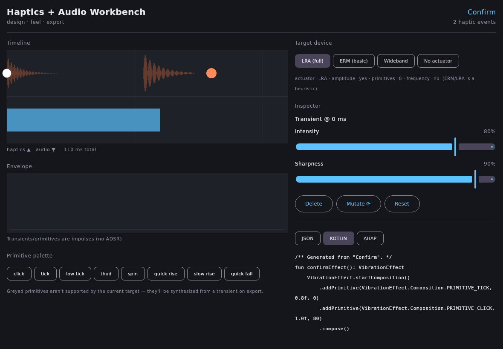

# Haptics + Audio Workbench

> **Constellation** · `state: active` · public · [registry: `Personal-Tracker/CONSTELLATION.md`](https://github.com/mbaliga/Personal-Tracker/blob/main/CONSTELLATION.md)
> Cross-platform haptics + audio authoring workbench (Kotlin Multiplatform), one backend-agnostic IR.

A cross-platform tool for **designing, feeling, and exporting haptic + sound effects**.
**Android is the primary, first-shipping target** (it's the only platform with a real haptic
actuator to feel effects on); the JVM desktop app is the secondary dev/debug driver, used to
validate `core` and the shared `:ui` composables without needing the Android SDK. Two
equally-weighted intents: a *playground* to explore and feel effects, and a *dev tool* that exports
effects into real apps.

Built with **Kotlin Multiplatform**; `kotlinx.serialization` is the native save format.

## The keystone: a backend-agnostic IR

Audio is universal (synthesized identically everywhere); haptics is platform-specific (and most
desktops have *no actuator at all*). So everything rests on a backend-agnostic **effect definition
(the IR)** that renders to whatever playback backend exists on the current platform — Android's
Vibrator, a controller voice-coil, or pure audio. Design the effect once; each backend interprets the
same data.

The IR borrows Apple's Core Haptics model: events on a timeline, each carrying **intensity +
sharpness** plus animatable breakpoint curves. See [`core/.../ir/Ir.kt`](core/src/commonMain/kotlin/dev/hnm/workbench/core/ir/Ir.kt).

## What's implemented now

This repo delivers the **`core` module** — the platform-agnostic keystone, fully built and
unit-tested on a JVM target — plus the **Android app** (`androidApp/`, the primary target) and a
**JVM desktop driver** (`desktopApp/`, the secondary dev/debug target):

| Area | Status | Where |
|---|---|---|
| IR (`@Serializable` events/tracks/curves/couplings) | ✅ | `core/.../ir/Ir.kt` |
| Native JSON save/load (polymorphic, `"type"` discriminator) | ✅ | `core/.../ir/Serialization.kt` |
| `PatternRenderer`: `renderAudio`, `renderHapticWaveform`, `scheduleHaptics` | ✅ | `core/.../dsp/DefaultPatternRenderer.kt` |
| DSP: oscillators, ADSR, biquad filter, parameter curves | ✅ | `core/.../dsp/` |
| Coupling: envelope follower (audio→haptic), sonify (haptic→audio) | ✅ | `core/.../dsp/` |
| Shared `TransportClock` + latency compensation | ✅ | `core/.../playback/TransportClock.kt` |
| Capability model + graceful degradation (LRA / ERM / wideband) | ✅ | `core/.../playback/Backends.kt` |
| Exporters: Native JSON, Kotlin `VibrationEffect`, AHAP, WAV | ✅ | `core/.../export/` |
| Variations (mutate / family / A-B), capture-a-rhythm, pattern library | ✅ | `core/.../design/`, `core/.../library/` |
| `PatternTransport`: audio + haptics on one clock w/ latency comp | ✅ | `core/.../playback/PatternTransport.kt` |
| Compose Multiplatform editor UI (timeline, envelope, palette, inspector, live export) | ✅ | `ui/` |
| **Android app: Vibrator backend, capability probe, full workbench UI (primary target)** | ✅ | `androidApp/`, backend design notes in [docs/ANDROID.md](docs/ANDROID.md) |
| JVM desktop audio backend (`javax.sound`) + CLI driver (secondary dev/debug target) | ✅ | `desktopApp/` |
| Controller backends (SDL rumble, DualSense HID) | 📋 planned | [docs/MODULES.md](docs/MODULES.md) |

> The `:androidApp` module (and the Android target on `core`/`:ui`) only wires into the Gradle build
> when the Android SDK is available — set `ENABLE_ANDROID=1` or point `local.properties` at an
> `sdk.dir` (see `settings.gradle.kts`). That's an environment guard, not a statement about priority:
> this dev container and the JVM-only `ci.yml` runner don't carry the Android SDK, so without the
> guard `./gradlew build` would break there. The dedicated [`android.yml`](.github/workflows/android.yml)
> workflow sets `ENABLE_ANDROID=1` and builds/installs a real debug APK on every push/PR. Controller-HID
> backends remain a documented reference, not yet wired into the build — see
> [docs/MODULES.md](docs/MODULES.md).

### The editor

The Compose Multiplatform editor (`:ui`) renders headlessly in CI (`:ui:jvmTest` paints the whole tree
off-screen to `ui/build/preview/workbench.png`) and runs as a desktop window via `./gradlew :ui:run`:



## Run it

```bash
# Android (primary target) — needs the Android SDK. Set ENABLE_ANDROID=1, or let Android Studio
# write local.properties' sdk.dir for you; either signal wires :androidApp into the build
# (see settings.gradle.kts). This dev container has no SDK, so this only runs where one is installed.
ENABLE_ANDROID=1 ./gradlew :androidApp:assembleDebug

# JVM desktop (secondary dev/debug target) — build everything and run the test suite. No Android SDK
# needed; this is how `core` and `:ui` get validated in this container and in `ci.yml`.
./gradlew build
./gradlew :core:jvmTest

# Render the worked "Confirm" example: prints native JSON / Kotlin / AHAP exports and
# writes confirm-audio.wav + confirm-haptic.wav. Add --play to hear it (if an output device exists).
./gradlew :desktopApp:run
./gradlew :desktopApp:run --args="--play"

# Launch the Compose editor window (needs a display)
./gradlew :ui:run
```

The driver reproduces the brief's worked examples exactly — e.g. the Kotlin export:

```kotlin
fun confirmEffect(): VibrationEffect =
    VibrationEffect.startComposition()
        .addPrimitive(VibrationEffect.Composition.PRIMITIVE_TICK, 0.8f, 0)
        .addPrimitive(VibrationEffect.Composition.PRIMITIVE_CLICK, 1.0f, 80)
        .compose()
```

## Architecture & roadmap

See [docs/MODULES.md](docs/MODULES.md) for the module layout, the critical Rust-graftable seam, and
the M0–M7 build order with current status.

For where the authoring UI goes next — visual/procedural haptic design (motion primitives → texture
fields → physics/material), the perceptual grounding, and AI's role as a parameter-space navigator —
see [docs/AUTHORING-INTERFACES.md](docs/AUTHORING-INTERFACES.md).

## Do not touch

- The **`:androidApp` module (and the Android target on `core`/`:ui`) is gated behind `ENABLE_ANDROID=1` or a local `sdk.dir`** in `settings.gradle.kts` / `core/build.gradle.kts` / `ui/build.gradle.kts`. This exists purely because this dev container and the JVM-only `ci.yml` runner don't have the Android SDK — it is **not** a signal that Android is secondary. Keep the guard: don't remove it or force it on unconditionally, or `./gradlew build` breaks in SDK-less environments. The default `./gradlew build` here stays JVM-only for that reason, but Android is still checked on every push/PR via the dedicated [`android.yml`](.github/workflows/android.yml) workflow, which sets `ENABLE_ANDROID=1` on a runner that does have the SDK.
- The single backend-agnostic IR (`HapticAudioPattern`) is the spine — keep the render/export seam swappable per backend.
