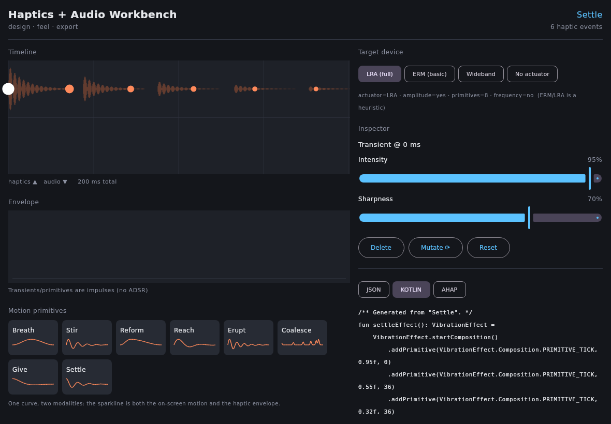
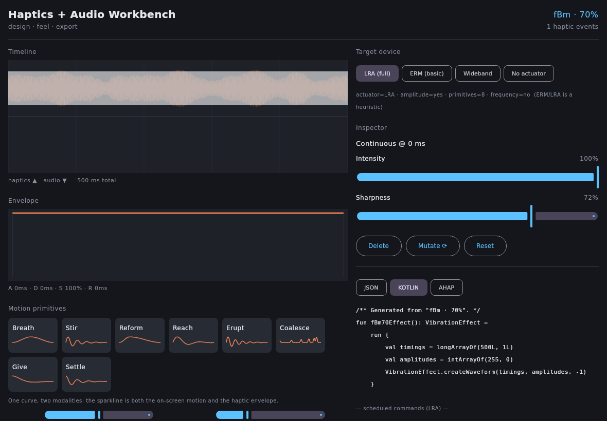
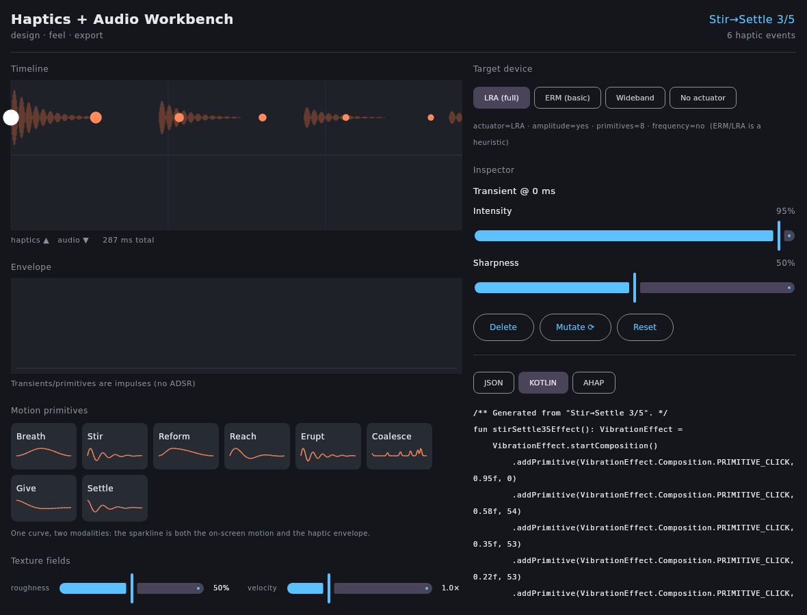

# Visual & Procedural Authoring Interfaces for Haptics: A Map of the Buildable and the Frontier

> **Implementation status (Stages 1–3 landed).** The motion-primitive route is now live: `core`'s
> `MotionPrimitives` generates the eight named primitives (Breath, Stir, Reform, Reach, Erupt,
> Coalesce, Give, Settle) from deterministic spring-mass-damper / swell math — one value-over-time
> curve that is both the on-screen motion and the haptic envelope. Oscillatory primitives render as
> transients at the motion's peaks (playable on any actuator); swells render as a `Continuous` whose
> intensity follows the curve. The Compose editor has a motion-primitive palette (each tile sparklines
> its curve; tap to load), and the whole thing flows through the existing renderer/exporters
> (e.g. Settle exports as a decaying `PRIMITIVE_TICK` train). Covered by `MotionPrimitivesTest`.
> See the editor with Settle loaded: .
>
> **Stage 2 (texture fields) is also live.** `core`'s `TextureFields` generates Perlin gradient noise,
> 1-D Worley (cellular/Voronoi), fractal Brownian motion (fBm), and value noise fields, each
> scrubbable at an arbitrary velocity — the velocity-driven playback law (finger speed →
> instantaneous temporal frequency) that the surface-haptics research establishes as the right
> interaction model. Roughness maps to spatial frequency exponentially (1–64 Hz/unit) because the
> perceptual roughness dimension is approximately log-scaled. The editor's `TexturePalette` shows all
> four field types with live roughness and velocity sliders; the Android player (v0.5) includes
> smooth/mid/rough variants of each type plus a slow-vs-fast Perlin pair to demonstrate the velocity
> law on the actuator. Covered by `TextureFieldTest`.
> See the editor with an fBm field scrubbed in (the timeline is the felt envelope):
> .
>
> **Stage 3 (parameter navigator) is also live.** `core`'s `ParameterNavigator` does the deterministic,
> on-device half of the relocated-AI story: linear interpolation between two authored feels, producing
> a perceptually graded family. Two latent spaces are already continuous — `TextureField`
> (roughness/density/octaves) and `SpringParams` (naturalHz/damping/x0/v0, now extracted from the
> motion primitives) — so `interpolate(a, b, t)` / `family(a, b, n)` walk smooth→rough or ringy→dead.
> The editor's `NavigatorPanel` fills a 5-tile family between two endpoints (tap to load); the Android
> player (v0.6) plays a Perlin smooth→rough walk and a Stir→Settle morph as ordered, monotonic
> gradients. The roadmap's Stage-3 threshold — *"give me a family of 5 produces perceptually graded,
> monotonic variation"* — is checked by `ParameterNavigatorTest` (texture crossing-counts and motion
> oscillation-counts both vary monotonically across the family). A learned interpolator could later
> replace the straight-line walk with a perceptually-shaped trajectory behind the same API.
> . Stage 4 remains the forward map.

## TL;DR
- **The motion-primitive route is the right thing to build first.** Animation and haptics already share a time axis, so a named easing/spring vocabulary (Breath, Stir, Settle…) maps directly and reliably onto Android's envelope IR with essentially zero perceptual guesswork — it is both the most buildable-now and the most perceptually dependable of the three routes. Texture-fields are the most novel and inspiring but need perceptual tuning; physics/material is the most powerful but the most complex and should come last.
- **The perceptual science backs the pivot away from language.** Vision and touch share an amodal "roughness" channel (spatial frequency/grain ↔ vibration frequency; density ↔ event rate), so a visual/material handle is a far less lossy controller of felt vibration than a word is — exactly the gap the user identified with cross-cultural onomatopoeia.
- **AI's relocated role — parameter→parameter inside a perceptual space — is the tractable one, and the research agrees.** Texture/material latent spaces (StyleGAN-based MaterialGAN, differentiable MATch/DiffMat, VAE texture latents) already support smooth interpolation and "generate-a-family-from-one-example." Cross-modal vision→vibration GANs (TactGAN, Vis2Hap, FrictGAN) exist but are research-grade and data-hungry; on-device, start with procedural-noise + lightweight learned mappings, not large generative models.

## Key Findings

**1. Three viable visual routes, with a clear maturity ordering.** The motion-primitive route rests on decades-mature, deterministic technology (easing curves, spring-mass-damper animation) that is literally already an envelope. The texture-field route has strong research foundations (data-driven texture models, surface-haptics rendering) but most of that work targets specialized hardware (force-feedback styli, electrovibration/ultrasonic plates) rather than a phone LRA, so it needs perceptual re-tuning for the mobile vibrotactile case. The physics/material route is the most expressive and unifies sound + haptics through shared physical models, but real-time modal/friction simulation is the heaviest lift.

**2. Android's haptic IR is already envelope-and-primitive shaped.** Modern Android (API 31+ composition primitives; API 36 / Android 16 envelope APIs) exposes exactly the IR the user is building toward: a timeline of primitives (CLICK, TICK, THUD, SLOW_RISE, QUICK_RISE, SPIN…) plus piecewise-linear envelopes over intensity and frequency/sharpness. This is structurally near-identical to Apple Core Haptics (transient/continuous events with intensity + sharpness + breakpoint curves), so a KMP IR can target both.

**3. The perceptual grounding is real but bounded.** The vision↔touch correspondence is strongest for roughness/spatial-frequency and weaker for hardness/slipperiness, which vibration alone cannot convey well. This bounds what the texture route can honestly promise on a phone.

**4. AI for textures/materials is mature; AI for haptics specifically is early.** Material generation (MaterialGAN, MATch/DiffMat, MatFormer, text/image→procedural-graph) is production-adjacent. Direct vision→vibration generation is a handful of GAN papers on niche datasets (LMT-108, HaTT). The most promising near-term AI is operating *inside* a procedural/material parameter space and letting a deterministic mapping produce the haptic signal.

## Details

### 1. Texture-to-haptic rendering (the texture-field route)

**The core mapping problem.** The dominant, empirically supported correspondence is *spatial frequency / grain → vibration frequency* and *feature height/contrast → amplitude*, with *feature density → transient/event rate*. Research on electrovibration displays established mappings where gradients in a visual texture drive frequency and amplitude (conveying height/hardness), and mid-air haptics work found a roughly linear relationship between perceived roughness and "draw frequency" over a usable band (e.g., a 25–75 Hz range mapped to a smooth→rough scale). A recurring finding: lower-frequency modulation reads as rougher/coarser, higher-frequency as finer/smoother, and directionality of a texture maps to anisotropy in the scrubbing response.

**Procedural noise as a haptic source.** Perlin/Simplex gradient noise, Worley/cellular noise, and reaction-diffusion are all directly usable as 1-D haptic signal generators when sampled along a scrub path. Fractal Brownian motion (summing octaves of Perlin noise at increasing frequency/decreasing amplitude) gives a natural "grain knob": octave count and base frequency control fine-vs-coarse, amplitude controls intensity. [Eureka](https://eureka.patsnap.com/article/procedural-texture-generation-with-perlin-noise-and-fractals) This is the cheapest, most controllable on-device texture source — no data, no model, fully parametric, and the same field renders as a visible texture and a felt one.

**Data-driven texture haptics.** The Penn Haptic Texture Toolkit (HaTT; Culbertson, Lopez Delgado & Kuchenbecker, 2014) is the canonical resource. Per the UPenn GRASP/Haptics Lab, HaTT's 100 isotropic, homogeneous textures are "divided across ten material categories (paper, plastic, fabric, tile, carpet, foam, metal, stone, carbon fiber, and wood)," recorded at a 10 kHz sampling rate with open rendering code for an impedance-type device such as a SensAble Phantom Omni. The modeling lineage is linear-predictive-coding → low-order autoregressive (AR) → piecewise-AR models that are speed- (and to a lesser extent force-) responsive. Crucially, Culbertson & Kuchenbecker found that "removing speed responsiveness did cause a statistically significant decrease in perceived realism, but removing force responsiveness did not, indicating that virtual textures aiming to simulate real surfaces should vary the rendered vibrations with user speed but may not need to vary them with user force." The TU Munich LMT Haptic Texture Database (Strese et al.) — including the widely used LMT-108 surface-materials set — pairs surface images with accelerometer (and sound/friction) traces from tool dragging, and is the dataset most cross-modal haptic GANs train on. A newer Cluster Haptic Texture Database (118 materials) adds controlled velocity/direction variation.

**"Scrubbing a surface."** Position/velocity-driven playback is the established interaction model: the finger's instantaneous speed across the texture modulates the rendered vibration. Surface-haptics displays implement this in hardware — TPaD and STIMTAC/LATPaD (ultrasonic squeeze-film friction reduction, Northwestern/Lille), and electrovibration displays (TeslaTouch, Tanvas TanvasTouch) modulate friction as a function of finger position and velocity. [Tanvas](https://tanvas.co/technology) On a phone you don't have friction modulation, but the *same control law* (velocity → instantaneous frequency/amplitude of the LRA) is the right abstraction for scrubbing a procedural texture field.

**Image/photo-to-texture pipelines.** Methods exist that derive a roughness map from a photo (shape-from-shading, gradient analysis) and map it to vibration frequency/amplitude; [arxiv](https://arxiv.org/pdf/2301.06826) the frontier version is learned (see §4: TactGAN, Vis2Hap).

### 2. Procedural animation / motion-primitive authoring (the motion route)

**Shared time axis = the key insight, and it is correct.** An animation curve *is* an envelope: value-over-time. A bounce animation and a "bounce" haptic envelope are the same signal sampled into two modalities. Android's own docs demonstrate this literally — they show driving `PRIMITIVE_THUD` from a `BounceInterpolator`'s animation-update callback, and building a "bouncing spring" haptic with the envelope API timed to the visual bounce. [Android Developers](https://developer.android.com/develop/ui/views/haptics/custom-haptic-effects) This is the strongest argument for sequencing the motion route first.

**Easing/spring authoring repurposed as envelope authoring.** Cubic-bezier easing (`ease-in`, `ease-out`, standard/emphasized curves) and spring physics are ready-made envelope generators. Android's `androidx.dynamicanimation` `SpringAnimation`/`FlingAnimation` expose `stiffness`, `dampingRatio`, and start-velocity (stiffness ~50f very-low to ~10,000f high; damping 1.0 no-bounce to 0.2 high-bounce) [LinkedIn](https://www.linkedin.com/pulse/introduction-physics-based-animations-android-richa-khanna) — these map cleanly to haptic feel: stiffness→onset sharpness/decay rate, damping→number of felt oscillations/ringing, velocity→initial amplitude. The same parameter vocabulary appears in iOS spring animations, React Spring, and Framer Motion, so the mapping is cross-platform conceptual.

**Named vocabularies as precedent.** Material Design's motion system (standard/decelerate/accelerate/sharp + emphasized easing, with duration scales) [Material Design](https://m2.material.io/design/motion/speed.html) and Disney's 12 principles (squash-and-stretch, anticipation, follow-through/overlap, slow-in/slow-out, secondary action) [DEmotion](https://trydemotion.com/blog/motion-design-principles-animation) are exactly the kind of *named, physically-grounded primitive set* the user wants. Follow-through/secondary motion and decay are literally haptic-envelope generators (a settling oscillation after an impact). This validates the user's Breath/Stir/Reform/Reach/Erupt/Coalesce/Give/Settle vocabulary as a haptic analogue of an established motion-design discipline.

**Natural mapping as the theoretical backbone.** Don Norman's *natural mapping* (The Design of Everyday Things, Ch. 3) — "taking advantage of physical analogies and cultural standards" [Usabilitypost](https://usabilitypost.com/2010/11/17/the-design-of-everyday-things/) so that controls map to effects with "immediate understanding," [Usabilitypost](https://usabilitypost.com/2010/11/17/the-design-of-everyday-things/) explicitly to *minimize the need for labels* — is the rigorous justification for deriving primitives from real-world physical actions rather than language. Verbatim: "If a design depends upon labels, it may be faulty. Labels are important and often necessary, but the appropriate use of natural mappings can minimize the need for them." This is the precise principle behind the user's design-system thesis (state shown through material behavior, never language). The user also cites a 2013 NID graduate project, "Dynamic Language" by Kanika Goyal, which reportedly derived interface motion primitives by abstracting physical actions (pedalling, winnowing, rolling, drape movement) via natural mapping; I was unable to verify this project on the open web (the name collides with a prominent fashion designer, and NID degree projects sit in a restricted archive at circulaid.nid.edu), so it should be treated as the user's own design lineage rather than a citable public source — but the *method* it embodies is exactly Norman's natural mapping and is fully defensible on that basis.

### 3. Physics / material-property authoring (the physics route)

**Physically-based haptic synthesis.** The mature techniques are modal synthesis (decompose an object into vibration modes, excite them with contact forces), mass-spring-damper contact/impact models, and friction models — Dahl, LuGre, and Karnopp — that generate continuous haptic signals from a simulated contact. Setting *material properties* (stiffness, mass/density, damping, friction coefficients) and letting the simulation produce the feel is a real authoring paradigm; modal frequencies and decay rates are functions of stiffness and damping, so a "stiffness" slider directly tunes pitch/sharpness and a "damping" slider tunes ringing/decay.

**Sound ↔ haptics crossover (very high value for this project).** The same physical models that synthesize contact *sound* synthesize contact *haptics* — this is the deepest justification for a combined sound+haptics editor. The canonical work is Kees van den Doel, Paul G. Kry & Dinesh K. Pai, "FoleyAutomatic: Physically-Based Sound Effects for Interactive Simulation and Animation," Proc. SIGGRAPH '01, ACM Press, pp. 537–544: real-time, physically-based contact sounds (impact, scraping, rolling) from modal resonance models driven by simulated contact forces, with algorithms "efficient, physically-based, and [that] can be controlled by users in natural ways," producing "high quality continuous contact sounds from dynamic simulations running at video rates." Perry Cook's STK and later example-guided modal synthesis extend this. Because audio and vibrotactile signals are both time-series excitations of a resonant model, one physics sim can author both channels in lockstep — and audio-to-haptic conversion (low-pass filtering / envelope extraction, as used by Interhaptics' audio import and many mobile pipelines) is the pragmatic bridge when you start from sound.

**Granular/particle systems** (sand, fluid, granular contact) are usable as haptic texture sources — event rate from particle-collision rate, amplitude from impact energy — and connect naturally to the density→event-rate mapping of the texture route.

### 4. AI / generative models in the visual/texture/material domain (the relocated-AI story)

**Material/texture generation is mature.** MaterialGAN (Guo et al., StyleGAN2-based) synthesizes realistic SVBRDF parameter maps and serves as a *latent prior* you can optimize within. [Shuangz](https://www.shuangz.com/publications/) MATch (Shi et al., 2020) with its DiffMat library makes Substance-style procedural node graphs *differentiable*, enabling gradient-based fitting of a procedural material to a target image [ACM Digital Library](https://dl.acm.org/doi/10.1145/3414685.3417781) — and, importantly, yielding an editable, arbitrary-resolution *parametric* output. MatFormer and text/image→procedural-graph methods (and VLMaterial using vision-language models) generate node-graph *structure*, not just parameters. [arXiv](https://arxiv.org/html/2501.18623v2) This is the strongest evidence for the user's thesis: the tractable, controllable AI operates on *procedural parameters*, not raw signals.

**Parameter-space interpolation = the user's "mutate into a family" goal, already demonstrated.** Smooth latent interpolation between textures/materials is well established (StyleGAN z/w interpolation, slerp; [APXML](https://apxml.com/courses/synthetic-data-gans-diffusion/chapter-2-advanced-gan-architectures-techniques/gan-latent-space-manipulation) VAE texture latents in "Texture Fields" show meaningful, smooth morphs). [arxiv](https://arxiv.org/pdf/1905.07259) The "generate a family from one example" operation is literally latent-neighborhood sampling. Notably, a 2026 arXiv paper, *Language-Guided Multimodal Texture Authoring via Generative Models*, aligns a multimodal VAE with CLIP to build a latent space where interpolating between two materials (e.g., towel→whiteboard) yields *crossmodally consistent* visual + haptic (tap/vibration) signals — and observes the interpolation follows a perceptually-shaped curved trajectory (mid-frequencies shift before high bands, matching human roughness sensitivity). [arxiv](https://arxiv.org/pdf/2604.06489) This is a direct frontier proof-of-concept for parameter→parameter haptic authoring inside a perceptual latent space.

**Cross-modal vision→haptic generation (research-grade).** TactGAN — Yuki Ban (The University of Tokyo) & Yusuke Ujitoko (Hitachi, Ltd.), "TactGAN: Vibrotactile Designing Driven by GAN-based Automatic Generation," SIGGRAPH Asia 2018 Emerging Technologies (DOI 10.1145/3275476.3275484) — generates a 2D amplitude spectrogram from a material image/attribute vector, then converts to a vibrotactile signal via the Griffin–Lim algorithm, trained on Strese et al.'s LMT data. Follow-ups include FrictGAN (friction signals from fabric images), CycleGAN image↔tactile, residue-fusion GANs, and Vis2Hap (Cao et al., ICRA 2023), which generates height maps + friction spectrograms from vision and renders them on a Tanvas display. [White Rose Research Online](https://eprints.whiterose.ac.uk/id/eprint/206418/) These work but are data-hungry, device-specific, and produce spectrograms that need Griffin-Lim-style inversion [ResearchGate](https://www.researchgate.net/publication/325586369_Vibrotactile_Signal_Generation_from_Texture_Images_or_Attributes_Using_Generative_Adversarial_Network) — not yet appropriate as the *primary* interface, which validates the user's decision to relocate AI.

**On-device feasibility (Android/KMP).** Tiered reality: (a) **Buildable now, on-device, no ML:** procedural noise fields (Perlin/Simplex/Worley/fBm), deterministic spring/easing envelopes, modal/friction math — all cheap, real-time, fully parametric. (b) **Buildable on-device with small models:** TFLite/LiteRT-hosted small VAEs/GANs for texture/parameter generation and latent interpolation; GAN compression/knowledge-distillation is an active area precisely because full GANs are too large for phones. (c) **Cloud-only for now:** large diffusion/material-graph generation (MATch optimization, MatFormer, diffusion texture synthesis). Recommended architecture: keep the *signal generation* deterministic and on-device; use AI (local-small or cloud) only to move points around in the *parameter/latent space*.

### 5. Existing visual haptic authoring tools & their interfaces

- **Waveform/keyframe editors:** Macaron — Oliver S. Schneider & Karon E. MacLean, "Studying Design Process and Example Use with Macaron, a Web-based Vibrotactile Effect Editor," 2016 IEEE Haptics Symposium, Philadelphia, pp. 52–58 (DOI 10.1109/HAPTICS.2016.7463155; open-source at hapticdesign.github.io/macaron) — is the reference web-based vibrotactile editor: waveforms of amplitude+frequency over time with editable keyframes and example-based design. VibViz (Seifi et al., 2015) organizes/visualizes/navigates a vibration library [ResearchGate](https://www.researchgate.net/publication/301800106_Studying_design_process_and_example_use_with_Macaron_a_web-based_vibrotactile_effect_editor) along perceptual facets. These are the "raw envelope drawing" baseline the user wants to go *beyond*.
- **Material-metaphor authoring:** Interhaptics Haptic Composer (now Razer, free) is the most direct precedent — it authors haptics as **four perceptions: Vibration, Texture, Stiffness, and Thermal**, with audio import and a premade-effects library, deploying across Android/iOS/Quest. This is essentially the material-handle paradigm the user is targeting, and worth studying closely.
- **Surface-haptics "painting":** Tanvas TanvasTouch SDK authors textures as *friction maps* (0–255 arrays) placed on screen regions like "drawing on a virtual canvas," with a Material/Texture/Sprite resource model [Tanvas](https://tanvas.co/resources/tanvastouch-basics/tanvastouch-engine) and a dashboard viewer for rapid iteration. Hap2U and other ultrasonic displays are similar in spirit.
- **VR/game:** Interhaptics (Unity/Unreal/OpenXR) and Meta/console haptic tools; physics/material-based haptics appears mainly via Interhaptics' stiffness/texture perceptions.
- **Research prototypes (CHI/UIST/World Haptics/EuroHaptics):** Macaron, VibViz, the texture-GAN line, and mid-air "Fellustrator" (mid-air haptic sketching) are the key references for design tooling.

### 6. Perceptual grounding (why visual/physical mapping beats language)

The multisensory literature (Lederman & Klatzky; Bensmaïa & Hollins, "The vibrations of texture"; Spence et al.'s roughness review) establishes that roughness is partly an *amodal* property accessible to both vision and touch, [ResearchGate](https://www.researchgate.net/publication/362992485_Roughness_perception_A_multisensorycrossmodal_perspective) and that vision and touch perform comparably on texture/roughness judgments [ResearchGate](https://www.researchgate.net/profile/Nicola-Di-Stefano/publication/362992485_Roughness_perception_A_multisensory-crossmodal_perspective/links/6309b0ab5eed5e4bd12135d8/Roughness-perception-A-multisensory-crossmodal-perspective.pdf) — with touch dominant for *fine* textures [nih](https://www.ncbi.nlm.nih.gov/pmc/articles/PMC7435275/) and vision biased toward geometric pattern features. Critically, tactile fine-texture perception is mediated by *vibration* (Pacinian channel), and the temporal/spectral frequency content is the shared currency between a seen spatial frequency and a felt vibration. Visual-motion information even modulates tactile roughness perception. This is the scientific isomorphism that justifies "texture-as-feel": a visual grain knob and a vibration-frequency knob are tapping the same perceptual dimension, whereas a *word* for the feeling must cross a lossy semantic/cultural gap (the user's onomatopoeia point). Caveat from the same literature: vibration conveys roughness well but *hardness and slipperiness* poorly, so material handles for stiffness/friction will be perceptually weaker on a phone LRA than grain/roughness handles.

### 7. Synthesis & sequencing

**The user's hypothesis is correct and well-supported.** Ranked by *perceptual reliability × buildability-now*:

1. **Motion-primitive route — BUILD FIRST.** Deterministic, no perceptual guesswork (the curve *is* the envelope), trivially maps to Android's envelope/primitive IR and to Core Haptics, and has a mature named-vocabulary precedent (Material/Disney) to model Breath/Stir/Settle on. Spring parameters (stiffness/damping/velocity) give an intuitive, physically-grounded control surface shared with the visual animation. This is the lowest-risk, highest-coherence starting point and immediately delivers the "one signal, two modalities" promise.
2. **Texture-field route — BUILD SECOND.** Start fully procedural (Perlin/Worley/fBm fields you scrub, velocity-driven), because that's on-device, parametric, and visually identical to the felt result. Layer data-driven realism (HaTT/LMT-derived AR models) and AI later. Reserve perceptual tuning effort here (roughness mapping band, velocity law). High novelty, moderate risk.
3. **Physics/material route — BUILD THIRD.** Highest expressivity and the natural home of the sound+haptics unification (modal synthesis drives both), but the heaviest engineering (real-time modal/friction sim) and weaker perceptual payoff for some handles (hardness/slipperiness) on a phone. Introduce material handles (stiffness/damping→modal pitch/decay) once the motion and texture routes are solid.

**Where AI enters:** *not* at the front and *not* across the language gap. Enter AI at stage 2–3 as a **parameter/latent navigator**: (a) interpolate between two authored textures/materials to fill a family; (b) sample latent neighborhoods to "mutate a motion primitive into a family"; (c) optionally generate procedural texture fields. Keep generation deterministic and on-device; use learned models only to move within the perceptual parameter space. The 2026 language-guided multimodal-texture VAE+CLIP work shows the eventual destination (a shared visual-haptic latent), but the buildable path today is procedural-first with small learned interpolators.

## Recommendations

**Stage 0 — IR foundation (now).** Finalize the KMP envelope IR as a timeline of events with intensity + sharpness breakpoint curves plus transient/emphasis markers, mapping to Android `WaveformEnvelopeBuilder`/`Composition` primitives (CLICK/TICK/THUD/SLOW_RISE/QUICK_RISE/SPIN) and Core Haptics AHAP. Build device-capability probing (`areEnvelopeEffectsSupported`, `hasAmplitudeControl`, FOAM/`VibratorFrequencyProfile`) and a graceful fallback ladder, since rich haptics are supported on fewer devices. *Benchmark to advance:* IR round-trips identically to a hand-drawn envelope on ≥2 device tiers.

**Stage 1 — Motion primitives (build first).** Implement Breath/Stir/Reform/Reach/Erupt/Coalesce/Give/Settle as parametric curve generators backed by spring (stiffness/damping/velocity) and easing math, each rendering simultaneously as a visual animation preview and an envelope. Reuse `androidx.dynamicanimation` semantics so the parameters are familiar. *Threshold to proceed to Stage 2:* users can author a recognizable, repeatable feel from a primitive without touching a raw waveform, and the same parameters drive a convincing on-screen motion.

**Stage 2 — Procedural texture fields.** Add scrubbable Perlin/Simplex/Worley/fBm fields with a velocity-driven playback law (finger speed → instantaneous frequency/amplitude). Calibrate the roughness→frequency band on real devices (anchor on the documented mid-band roughness mapping). Then optionally ingest HaTT/LMT AR-model textures as presets. *Threshold:* blind users reliably rank "fine vs coarse" and "sparse vs dense" fields consistent with the visual.

**Stage 3 — AI as parameter navigator.** Add latent/parameter interpolation between authored textures and motion primitives (slerp in a small learned or procedural-parameter space), running on-device via TFLite/LiteRT where model size permits; defer heavy generation to cloud. *Threshold:* "give me a family of 5 variations of this" produces perceptually graded, monotonic variation.

**Stage 4 — Physics/material + sound unification.** Introduce modal/mass-spring-damper + friction (LuGre/Karnopp) synthesis so one material (stiffness/damping/friction/density) drives both the haptic envelope and a FoleyAutomatic-style contact sound. *Threshold:* a single material edit audibly and haptically co-varies in a way users judge "the same event."

**Throughout:** study Interhaptics Haptic Composer (Vibration/Texture/Stiffness/Thermal model) and Macaron as direct UX precedents; respect the vibration-conveys-roughness-not-hardness limit by leading with grain/roughness/density handles and treating stiffness/slipperiness as secondary.

## Caveats
- **The Kanika Goyal "Dynamic Language" (NID, 2013) project could not be independently verified** on the open web; treat it as the user's internal design lineage. The underlying *method* (deriving primitives from physical actions via natural mapping) is fully defensible via Don Norman's documented natural-mapping principle.
- **Most data-driven and surface-haptics texture research targets non-phone hardware** (force-feedback styli, electrovibration/ultrasonic plates with finger-position sensing). Findings transfer in *principle* (velocity-driven frequency/amplitude mapping) but require re-tuning for a single-LRA phone; do not assume realism numbers carry over.
- **Vibration is a weak channel for hardness/slipperiness/stiffness** — the perceptual literature is consistent on this — so material-property handles will feel less faithful than roughness/grain handles on current phones.
- **Cross-modal vision→haptic GANs are research-grade**, trained on small specialized datasets (LMT-108, HaTT), often output spectrograms needing inversion, and are not yet suitable as a primary on-device interface. The 2026 language-guided VAE+CLIP texture-authoring paper is a recent preprint and a direction-of-travel signal, not shipped technology.
- **On-device generative AI remains constrained**: full GANs/diffusion are too large for phones today (hence active GAN-compression research); the safe architecture keeps signal synthesis deterministic and uses AI only for parameter-space navigation.
- Android's envelope APIs require **Android 16 (API 36)** for full PWLE support; composition primitives need API 31+. Plan for substantial device fragmentation.
